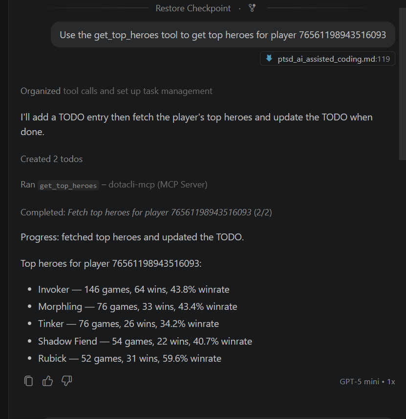
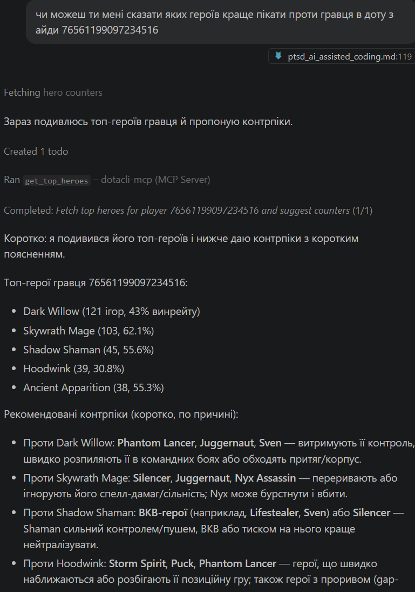
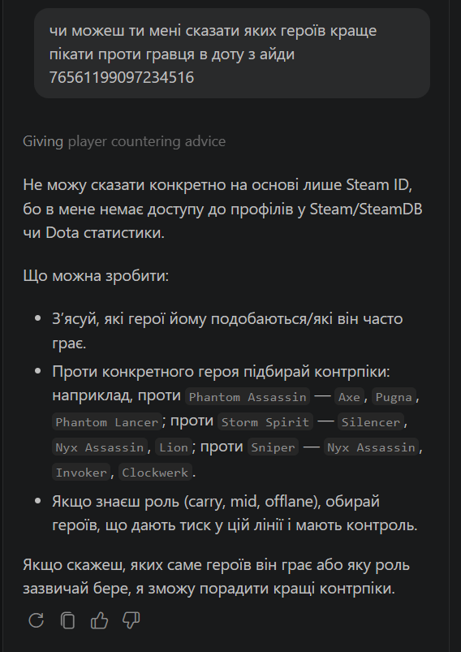

# Dota 2 CLI + MCP Server

A .NET 10 command-line utility for fetching Dota 2 player statistics via the OpenDota API, exposed as an MCP tool for AI clients.

## Project Structure

```
dotacli/        — CLI utility (standalone product)
dotacli-mcp/    — MCP server (adapter between AI client and CLI)
```

Two separate projects in one solution. `dotacli` works independently from MCP and can be run manually from the terminal. `dotacli-mcp` contains no business logic — it launches `dotacli.exe` as a subprocess and returns the result to the AI client.

## Technologies

- `.NET 10` — both projects
- `System.CommandLine` — CLI argument parsing
- `ModelContextProtocol` (v1.3.0) — MCP SDK for tool registration
- `Microsoft.Extensions.Hosting` — DI, host, configuration
- `Microsoft.Extensions.Logging.Console` — logging to stderr
- OpenDota API — https://www.opendota.com/api-keys re-name appsettings.example.json to appsettings.json and insert the api key
## Layer 1 — CLI Utility (`dotacli`)

### Build

```bash
dotnet build dotacli
```

### Commands

**Top heroes for a player:**
```
dotacli top-heroes <id> [--limit N]
```

**Recent ranked matches:**
```
dotacli recent-matches <id> [--limit N]
```

`<id>` — SteamID64 or AccountID of the player. Automatic conversion between formats is supported.

### Example Output
```
dotnet run --project dotacli -- top-heroes 76561198943516093
```

```
Hero                 | Games  | Wins     | Winrate
-------------------------------------------------
Invoker              | 146    | 64       |  43,8%
Morphling            | 76     | 33       |  43,4%
Tinker               | 76     | 26       |  34,2%
Shadow Fiend         | 54     | 22       |  40,7%
Rubick               | 52     | 31       |  59,6%
-------------------------------------------------
```

### Exit Codes

| Code | Name               | Description                                  |
|------|--------------------|----------------------------------------------|
| 0    | Success            | Command completed successfully               |
| 1    | ApiError           | Failed to fetch data from OpenDota API       |
| 2    | InvalidArguments   | Invalid command-line arguments               |
| 3    | NoDataFound        | Player not found or no ranked data available |

## Layer 2 — MCP Server (`dotacli-mcp`)

MCP (Model Context Protocol) is a protocol for standardized interaction between an AI agent and external tools. The server describes available tools, their parameters, and response types in a format that an AI client can read and invoke automatically.

Transport: **stdio** — the client launches the process and communicates via stdin/stdout using JSON-RPC.

### Available Tools

#### `get_top_heroes`
Returns the most-played ranked heroes for a player.

| Parameter  | Type   | Required          | Description                        |
|------------|--------|-------------------|------------------------------------|
| `playerId` | string | Yes               | SteamID64 or Account ID of player  |
| `limit`    | int    | No (default: 5)   | Number of heroes to return         |

#### `get_recent_matches`
Returns the most recent ranked matches for a player.

| Parameter  | Type   | Required          | Description                        |
|------------|--------|-------------------|------------------------------------|
| `playerId` | string | Yes               | SteamID64 or Account ID of player  |
| `limit`    | int    | No (default: 5)   | Number of matches to return        |

### How the MCP Server Calls the CLI

```
AI client --> get_top_heroes(playerId, limit)
                    |
             dotacli-mcp receives the call
                    |
             launches: dotacli.exe top-heroes <id> --limit <n>
                    |
             reads stdout + exit code
                    |
             returns result to AI client
```

The server maps exit codes to human-readable messages. Errors (`stderr`) are separated from data (`stdout`).

### Build and Run

```bash
dotnet build dotacli
dotnet run --project dotacli-mcp
```

The server runs continuously and listens for JSON-RPC requests via stdin.

## Connecting to GitHub Copilot (VS Code)

1. Install the GitHub Copilot extension:
   ```
   winget install GitHub.Copilot
   ```

2. The `.vscode/mcp.json` file is already configured in the project:
   ```json
   {
     "servers": {
       "dotacli-mcp": {
         "type": "stdio",
         "command": "dotnet",
         "args": ["run", "--project", "${workspaceFolder}/dotacli-mcp/dotacli-mcp.csproj"]
       }
     }
   }
   ```

3. Open Copilot Chat (`Ctrl+Shift+I`) and switch to **Agent** mode.

4. VS Code will automatically start the MCP server. Verify via `Ctrl+Shift+P` → `MCP: List Servers`.

5. Test that the model calls the actual tool:
   ```
   Use the get_top_heroes tool to get top heroes for player 123456789
   ```
   Copilot should show the `get_top_heroes` tool call and return live data from the OpenDota API.

## Proof of MCP Tool Usage (for demo)

To prove the model is calling the local tool and not answering from training data:
with mcp server on:


with mcp server of:



## Testing with MCP Inspector

```bash
npx @modelcontextprotocol/inspector dotnet run --project dotacli-mcp
```

Opens a web UI for manually calling tools and inspecting JSON-RPC messages.
